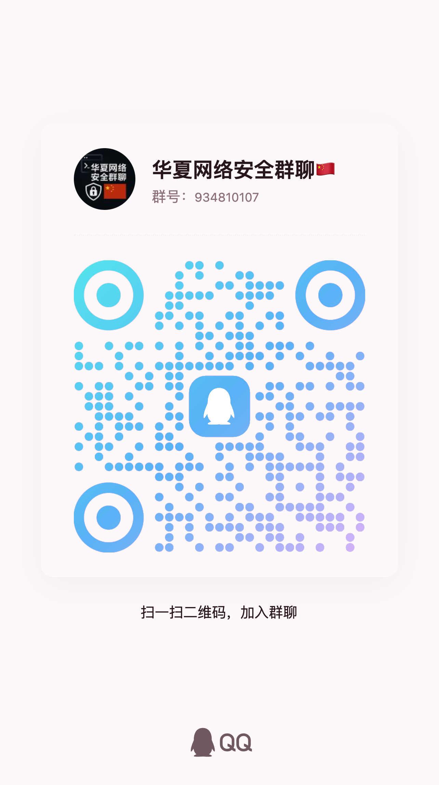
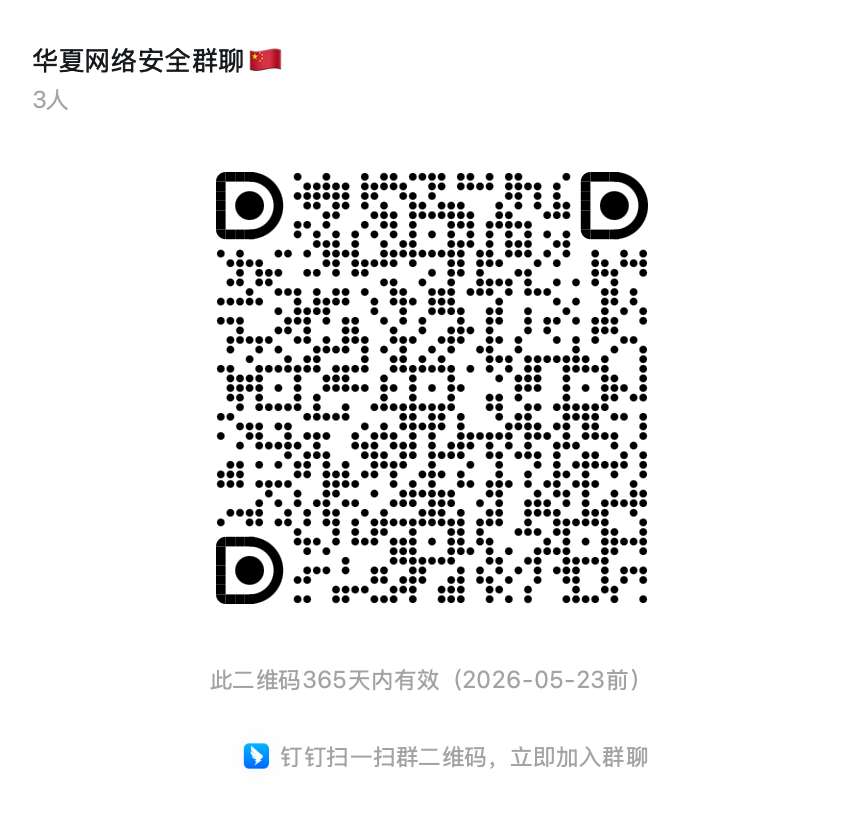

# FlutterDefend

FlutterDefend 是一个轻量级、模块化、可插拔的 **Flutter 移动端安全工具 SDK**，专为保护移动应用中的关键操作和数据设计。它提供了用于防御常见攻击和提升安全性的能力，例如 SQL 注入检测、本地加密存储、防截图输入字段封装，以及越狱/root 设备检测。

适用于中大型应用的安全基线，也适用于对隐私和安全有基本需求的中小应用。

---

## ✨ 功能特性

- 🔐 **本地加密存储**（使用凯撒密码，基于实例密钥）
- 🛡️ **SQL 注入检测**（运行时输入内容分析）
- 🖊️ **安全输入封装组件**（禁止粘贴、禁止截图、自带校验器）
- 📱 **越狱/Root 检测**（基于原生接口）
- 📦 统一 SDK 门面类：`FlutterDefend`

---

## 🔧 安装方式

在 `pubspec.yaml` 中添加依赖：

```yaml
dependencies:
  flutter_defend:
    git:
      url: https://github.com/ctkqiang/flutter_defend.git
```

或

```yaml
dependencies:
  flutter_defend:
    git:
      url: https://gitcode.com/ctkqiang_sr/flutter_defend.git
```

或发布至 pub.dev 后使用：

```yaml
dependencies:
  flutter_defend: ^0.1.0
```

然后执行：

```bash
flutter pub get
```

---

## 🧠 SDK 组件说明

### 1. `SecuredStorage`

封装后的本地加密 Key-Value 存储。

#### 核心逻辑：

- 每个实例基于传入的 `passphrase` 推导加密偏移量（即位移）
- 可选一方向加密模式（类似哈希，不能解密）
- 借助 `FlutterSecureStorage` 进行数据落地存储

#### 示例：

```dart
final storage = FlutterDefend.secureStorage;
await storage.write("token", "my-secret-token");
final token = await storage.read("token");
```

#### 使用动态密钥：

```dart
final userStorage = FlutterDefend.withPassphrase("user-session-token");
await userStorage.write("email", "alice@example.com");
```

---

### 2. `SQLInjection`

简单的 SQL 注入字符串关键字检测模块。

#### 使用方式：

```dart
final input = "SELECT * FROM users";
if (FlutterDefend.sqlInjection.containsInjection(input)) {
  throw Exception("检测到潜在 SQL 注入风险。");
}
```

#### 实现原理：

- 将输入转小写
- 使用关键词匹配，如 `select`、`drop`、`or 1=1`、`--` 等
- 返回布尔值判断结果

---

### 3. `SecureInput`

封装 TextField 组件，提供以下保护：

- 自动防止 SQL 注入输入
- 可选禁止粘贴、长按复制
- 可选屏蔽截图（Android / iOS）

#### 示例：

```dart
final inputField = FlutterDefend.secureInput.wrapTextField(
  TextField(
    controller: myController,
    obscureText: true,
    decoration: InputDecoration(labelText: "密码"),
  ),
);
```

#### 可选参数：

- `preventPaste: true` 禁止粘贴
- `preventScreenshot: true` 禁止截图录屏
- `validator` 自定义校验逻辑（默认为 SQL 注入检查）

---

### 4. `Jailbreak`

检测设备是否越狱（iOS）或 Root（Android）。

#### 示例：

```dart
final compromised = await FlutterDefend.jailbreak.isDeviceCompromised();
if (compromised) {
  // 采取阻断、上报等措施
}
```

#### 实现原理：

- 基于 `flutter_root_jailbreak` 插件
- 原生调用系统文件路径、权限、二进制检测等
- 返回布尔值

---

## 💡 总入口类：`FlutterDefend`

该类为静态工具类，聚合所有核心安全组件，便于统一调用：

```dart
FlutterDefend.secureStorage.write("token", "abc");
FlutterDefend.sqlInjection.containsInjection(userInput);
FlutterDefend.jailbreak.isDeviceCompromised();
FlutterDefend.secureInput.wrapTextField(...);
```

### 动态密钥构造器

```dart
final storage = FlutterDefend.withPassphrase("session-key");
```

适用于登录后或会话场景使用自定义密钥。

---

## 🔐 安全注意事项

- 凯撒密码为对称加密中的弱算法，**不能满足高级加密需求**

  - 推荐配合后端验证、或替换为 AES/GCM 算法

- 越狱/Root 检测可能被隐藏工具绕过（如 Magisk Hide）
- 安全应为端到端设计，前端仅为第一道防线

---

## 🏁 未来计划（Roadmap）

- 支持 AES256 加密（基于 pointycastle）
- SHA 系列一方向加密（如 SHA256）
- 剪贴板清除/替换机制
- 屏幕录制检测
- APK/IPA 篡改检测

---

## 👥 作者

- 作者：钟智强
- 邮箱：ctkqiang@dingtalk.com
- QQ：3072486255
- 微信：ctkqiang

---

### 🤝 加入技术交流群

欢迎加入我们的技术交流群，与其他安全研究者分享经验和知识！

<div align="center" style="margin: 20px 0">
<table>
<tr>
<td align="center" width="300">

<br />
<strong>QQ交流群: 934810107</strong>
<br />
（扫码加入，一起探讨安全技术）
</td>
<td align="center" width="300">

<br />
<strong>钉钉交流群</strong>
<br />
（扫码加入，一起探讨安全技术）
</td>
</tr>
</table>
</div>

---

## 许可证

本项目采用 **木兰宽松许可证 (Mulan PSL)** 进行许可。  
有关详细信息，请参阅 [LICENSE](LICENSE) 文件。  
（魔法契约要保管好哟~）

[](http://license.coscl.org.cn/MulanPSL2)

## 🌟 开源项目赞助计划

### 用捐赠助力发展

感谢您使用本项目！您的支持是开源持续发展的核心动力。  
每一份捐赠都将直接用于：  
✅ 服务器与基础设施维护（魔法城堡的维修费哟~）  
✅ 新功能开发与版本迭代（魔法技能树要升级哒~）  
✅ 文档优化与社区建设（魔法图书馆要扩建呀~）

点滴支持皆能汇聚成海，让我们共同打造更强大的开源工具！  
（小仙子们在向你比心哟~）

---

### 🌐 全球捐赠通道

#### 国内用户

<div align="center" style="margin: 40px 0">

<div align="center">
<table>
<tr>
<td align="center" width="300">

<br />
<strong>🔵 支付宝</strong>（小企鹅在收金币哟~）
</td>
<td align="center" width="300">

<br />
<strong>🟢 微信支付</strong>（小绿龙在收金币哟~）
</td>
</tr>
</table>
</div>
</div>

#### 国际用户

<div align="center" style="margin: 40px 0">
  <a href="https://qr.alipay.com/fkx19369scgxdrkv8mxso92" target="_blank">
    
  </a>
  
  <a href="https://ko-fi.com/F1F5VCZJU" target="_blank">
    
  </a>
  
  <a href="https://www.paypal.com/paypalme/ctkqiang" target="_blank">
    
  </a>
  
  <a href="https://donate.stripe.com/00gg2nefu6TK1LqeUY" target="_blank">
    
  </a>
</div>

---

### 📌 开发者社交图谱

#### 技术交流

<div align="center" style="margin: 20px 0">
  <a href="https://github.com/ctkqiang" target="_blank">
    
  </a>
  
  <a href="https://stackoverflow.com/users/10758321/%e9%92%9f%e6%99%ba%e5%bc%ba" target="_blank">
    
  </a>
  
  <a href="https://www.linkedin.com/in/ctkqiang/" target="_blank">
    
  </a>
</div>

#### 社交互动

<div align="center" style="margin: 20px 0">
  <a href="https://www.instagram.com/ctkqiang" target="_blank">
    
  </a>
  
  <a href="https://twitch.tv/ctkqiang" target="_blank">
    
  </a>
  
  <a href="https://github.com/ctkqiang/ctkqiang/blob/main/assets/IMG_9245.JPG?raw=true" target="_blank">
    
  </a>
</div>

---

🙌 感谢您成为开源社区的重要一员！  
💬 捐赠后欢迎通过社交平台与我联系，您的名字将出现在项目致谢列表！
